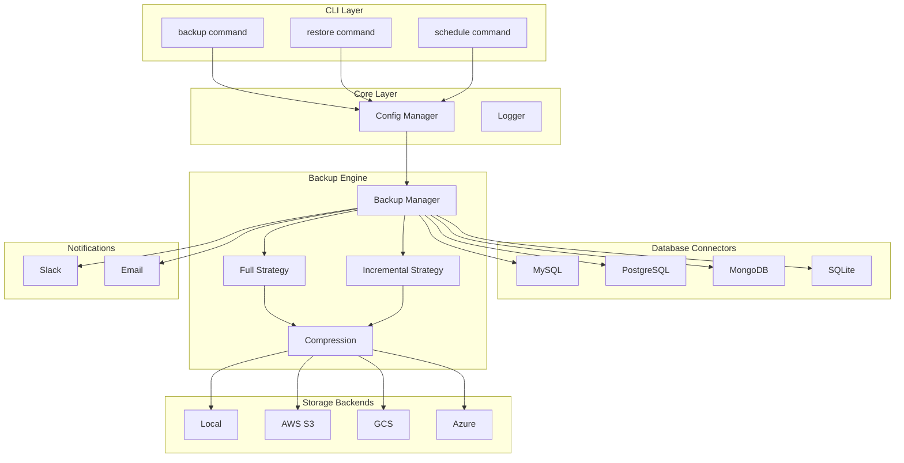

# Database Backup Utility - Architecture

## System Overview



---

## Component Architecture

### 1. CLI Layer
- Built with **Typer** for modern CLI experience
- Subcommands: `backup`, `restore`, `schedule`, `config`
- Supports both CLI args and YAML config files

### 2. Core Layer
- **Config**: Pydantic models for type-safe configuration
- **Logger**: Structured JSON logging with file rotation
- **Exceptions**: Hierarchy for specific error handling

### 3. Database Connectors
Abstract base class with common interface:

```python
class BaseConnector(ABC):
    def test_connection(self) -> bool: ...
    def get_databases(self) -> List[str]: ...
    def dump(self, output_path: Path) -> Path: ...
    def restore(self, backup_path: Path) -> bool: ...
```

Each DBMS implements using native tools:
- MySQL: `mysqldump` / `mysql`
- PostgreSQL: `pg_dump` / `pg_restore`
- MongoDB: `mongodump` / `mongorestore`
- SQLite: File copy operations

### 4. Backup Strategies
- **Full**: Complete database dump
- **Incremental**: Only changes since last backup (using binary logs/WAL)
- **Differential**: Changes since last full backup

### 5. Storage Backends
Abstract interface for pluggable storage:

```python
class BaseStorage(ABC):
    def upload(self, local_path: Path, remote_key: str) -> str: ...
    def download(self, remote_key: str, local_path: Path) -> Path: ...
    def list_backups(self, prefix: str) -> List[BackupInfo]: ...
    def delete(self, remote_key: str) -> bool: ...
```

### 6. Scheduler
- Uses **APScheduler** for cron-like scheduling
- Persistent job store for reliability
- Background daemon process

### 7. Notifications
- **Slack**: Webhook-based notifications
- **Email**: SMTP integration

---

## Data Flow

### Backup Flow
```
User Input → CLI Parser → Config Validation → Test DB Connection 
→ Select Backup Strategy → Execute Dump → Compress 
→ Upload to Storage → Log Activity → Send Notification
```

### Restore Flow
```
User Input → CLI Parser → Validate Backup File → Download if Remote
→ Decompress → Test Target DB → Execute Restore 
→ Validate Data → Log Activity → Send Notification
```

---

## Design Decisions

| Decision | Rationale |
|----------|-----------|
| Native dump tools | Reliable, well-tested, handle large DBs |
| Plugin architecture | Easy to extend for new DBMS |
| Pydantic config | Type safety, validation, env var support |
| APScheduler | Mature, persistent jobs, cron syntax |
| gzip compression | Good balance of speed and compression |
